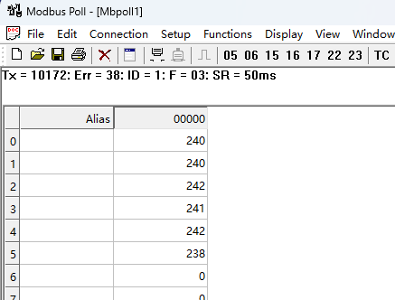

# Modbus 测试器
这是个用来测试Modbus设备通信的简单程序，源码主要是读取Arduino-UNO的6个模拟引脚。
写这个的主要目的是满足本人日常调试硬件协议使用就和做CI\CD集成测试使用。不过可以自由修改其源码，用起来很简单，很适合纯软件的朋友们使用，不过前提是你得买个Arduino或者其衍生产品。



## 编译
建议用 PlatformIO 框架，编译指令：
```sh
pio run -e uno -t upload --upload-port COM7
```